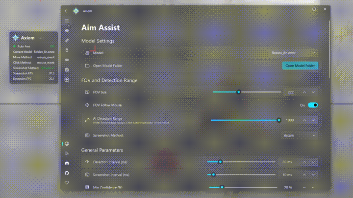

<div align="center">


<h1>Axiom AI</h1>
<p>Adaptive aim assistance powered by computer vision to support gamers who need it most.</p>

## <a href="https://discord.gg/DpcqaQEj5b">Discord (Support)</a>

<p>
  
</p>

<p><strong>If this project helps you, please give us a ⭐ Star!</strong></p>

</div>

## About this fork

The original Axiom AI Aimbot project (by iisHong0w0) is no longer maintained/available. This repository is a **new, "vibe coded" continuation** — rebuilt and extended largely through AI-assisted development on top of the last available codebase. Expect faster, more experimental iteration than a traditional hand-maintained project; things are actively being reworked, and some corners (see **Beta** below) are genuinely unfinished.

If you're looking for the original project, it's gone — this is what's actively developed now.

## Overview

Axiom AI is a computer vision application for real-time object detection and aim assistance. Built with Python and ONNX Runtime, it supports DirectML, CUDA, and TensorRT GPU acceleration paths with automatic fallback, and ships a modern Fluent Design UI with multi-language support and a first-run setup wizard.

## Beta features

These are early/incomplete — used at your own risk, and feedback is welcome:

- **Weapon detector (Apex Legends only, for now)** — selectable in Inference settings as `second_inference_mode` (Off / OCR / ONNX), runs in its own process so it never blocks the main aim loop.
  - **PaddleOCR-based** weapon-name reader — functional but currently not reliable/useful enough to depend on; left in the codebase but effectively unused (`src/core/ocr_inference.py`).
  - **YOLO-based** weapon HUD detector — trained models now ship in `Model_Hud/`, selectable from the Model page's HUD Model dropdown; still beta because results aren't yet wired into anything downstream.
  - Goal once this is trusted enough: automatically apply the matching recoil-control pattern for the detected weapon.

Found a feature in the code that isn't listed above? Let us know rather than assuming — some things in progress aren't ready to be called a "feature" yet.

## Key Features

- **Advanced Aim Control**
  - PID controller with separate X/Y axis tuning; an **Unsafe Mode** toggle re-maps the reaction-speed (Kp) sliders from the default safe 0–0.5 range up to a full 0–1.0 for users who want to push past the normally-capped travel.
  - Customizable FOV with independent width/height (so it can be a rectangle, not just a square) and an optional circle/ellipse shape, plus an independent detection range.
  - Single-target mode for focusing on the nearest threat.
  - FOV follows mouse cursor for dynamic aiming.
  - Configurable head/body region ratios, plus manual fine-tune for the exact aim point; the head ratio can also scale automatically with target distance (box height).
  - Aim deadzone to reduce over-travel on tiny corrections.

- **Humanization**
  - Master enable + intensity slider that scales every effect at once, plus a per-feature on/off toggle and fine-tuning sub-slider for each: micro-jitter, motion variation, speed shaping, micro-stutter, and reaction-time variability.
  - One-click **Reset to Defaults** for the whole block.

- **Anti-Recoil (Smart Jitter)**
  - Smart Jitter applies subtle movement to simulate natural hand shake while on target.
  - Choose between procedural random jitter or fully custom recorded patterns, with a 1×/2×/3×/5×/10× playback speed multiplier for recorded patterns.
  - **Jitter Recorder** — record your own mouse shake pattern directly from the Aim Assist page (click anywhere in the live-preview window to finish & save — no separate button to reach for mid-pattern) or via the standalone terminal tool (`src/core/jitter_recorder.py`).
  - Patterns are zero-net-displacement: each loop cycle returns the cursor to its original position.
  - LMB gate: optionally activate jitter only while left mouse button is held.

- **Y-Axis Recoil Suppression**
  - Dedicated Y-axis reduction with configurable delay, ramp, floor, settle threshold, and velocity-restore.
  - Automatically scales down upward correction to compensate for in-game weapon recoil.

- **Smart Tracker (Prediction System)**
  - Velocity-based (constant-velocity extrapolation) and 2D Kalman-filter-based motion prediction for leading moving targets — independent toggles, so both can run together (prediction extrapolates ahead, Kalman then smooths the result).
  - Configurable prediction horizon, history length, and a velocity sanity cap that discards history and resets cleanly on a sudden detection jump (e.g. a new target acquired far from the last one) instead of extrapolating garbage.
  - Both predictors also reset on true target loss so stale velocity never carries into whatever's acquired next.
  - Sticky lock with IOU-based target persistence across frames — tolerates a few bad detection frames without dropping the target; the IOU threshold adapts to FOV size.
  - Smart center-mass aim point that adapts to crouching targets.
  - Weighted target-priority modes — distance-only, confidence-only, or a composite of both.
  - Optional semantic false-positive filter (class allow/deny lists, geometry heuristics, min box size) to drop vegetation/vehicle/HUD misdetections before target selection.

- **Auto Fire (Triggerbot)**
  - Adjustable delay and fire intervals.
  - Target priority settings (Head / Body / Both).
  - Always-on mode or key-activated toggle.

- **High Performance**
  - ONNX Runtime with DirectML, CUDA, TensorRT, or CPU inference, with automatic fallback across providers.
  - **TensorRT engine caching** — models with no cached engine yet are automatically redirected to the Convert tab to build one in the background (with a progress bar) instead of freezing the aim loop on a blocking 1–5 minute compile. The Model page also shows a ✓/⬇ badge on every entry so you know which models already have a cached engine before you even pick one.
  - Zero-copy CUDA IO binding for minimal GPU↔CPU transfer overhead.
  - Low-latency three-thread pipeline: capture → preprocess → inference, fully decoupled.
  - Idle detection throttling to reduce resource usage when not aiming.
  - **Multiple Input Methods**
    - **SendInput** (Windows API)
    - **ddxoft**
    - **Arduino Leonardo**
    - **Xbox 360 Virtual Controller**
    - **MAKCU** (USB HID, 4 Mbaud, auto-reconnect, hardware button-state reads, Hold/Toggle aim mode with a configurable disengage delay)

- **Live Capture Preview**
  - Collapsible side panel shows the active capture feed in real-time with FPS counter.
  - Supports pop-out mode and optional crop to detection region.
  - Works with all backends: dxcam, MSS, UVC (with an optional native DirectShow v2 capture path for lower, OBS-like latency), NDI, and UDP (an MJPEG-over-UDP stream matching OBS's `udp_stream_filter` plugin, for capturing from a second PC).

- **Web ESP Overlay**
  - Streams live detection boxes/state to a lightweight web page over WebSocket.
  - Point an OBS Browser Source (or any browser, on any machine on the network) at it to render ESP without capturing the main game overlay.
  - HUD shows aim on/off, aim active/idle, model, capture method, capture FPS, inference FPS, target count, and network latency — draggable and stylable from the in-page settings panel.

- **Model & Config Management**
  - Searchable, filter-as-you-type model dropdown on both the Model and Convert pages.
  - Hotkey conflict warning — flags genuinely confusing rebinds (a redundant duplicate within the same key group, or the toggle key landing on the same button as a hold key) without flagging intentional "one button does two things" setups as a problem.
  - Loading a saved config preset shows a summary of exactly what it will change first, instead of silently overwriting your current settings.

- **Modern Fluent Design UI**
  - Built with PyQt6 + QFluentWidgets for a native Windows 11 look.
  - Acrylic (frosted glass) window effect with configurable transparency.
  - Dark / Light theme toggle.
  - Chroma visuals — cycling hue box colors for ESP-style overlays, plus named box-color theme presets.
  - First-run Setup Wizard for quick configuration.
  - Detailed Other page for debugging device/provider state.

- **Multi-Language Interface**
  - English, 中文, Français, Deutsch, हिन्दी, 日本語, 한국어, Português, Русский, Español.

## Supported Games (Pre-trained Models)

| Model | File |
|-------|------|
| Apex Legends | multiple variants in `Model/`, e.g. `Apex_16.5k_ep100_Y26_640.onnx` (pick by epoch/resolution/architecture) |
| Counter-Strike 2 | `CS2_8n.onnx` |
| Fortnite | `Fornite_8n.onnx` |
| PUBG | `Pubg_8n.onnx` |
| Roblox | `Roblox_8n.onnx` |
| Valorant | `Valorant[PURPLE]_8s.onnx` |

> You can also train and import your own ONNX models.

## Why does Axiom exist?

Axiom is designed for gamers who are at a disadvantage compared to regular players, including but not limited to:
- Players grieving from parental loss
- Physical disabilities
- Intellectual disabilities
- Visual impairments
- Poor hand-eye coordination
- Poor FPS performance
- Hand tremors
- Parkinson's disease
- Neurological disorders
- Players with one arm/hand
- Players using feet due to hand loss
- Players using mouth due to limb loss
- Paralyzed players using brain-computer interfaces or eye trackers
- Colorblind players
- Blind players
- Players without glasses
- Elderly players
- Chronic fatigue syndrome
- Nystagmus sufferers
- Brain injury sequelae
- Spatial perception disorders
- Anxiety disorders
- ADHD
- Movement disorders
- Autism
- Sleep-deprived players
- Overconfident players
- Players prone to overthinking
- Emotionally volatile players
- Wrong DPI settings
- No mousepad users
- Limited mouse space
- Low-quality mouse users
- Cloud gaming users
- Mouse acceleration enabled
- No air conditioning in hot/humid areas
- Sweaty hands causing mouse slippage
- Poor posture or low chairs
- Very young child players
- Beginners or untrained players
- Unstable vision players
- Special controller users
- Lucid dreamers
- Sixth sense aiming players
- Religious players who consider aiming sinful
- Fatalists who believe fate decides everything
- Players seeking randomness and chaos
- Role-playing blind snipers
- Players who think crosshairs are decorative
- Players who think they're in third person
- Crosshair drift syndrome sufferers
- Voice navigation aiming players
- Schizophrenia
- Parallel world delay sync players
- Quantum state players
- Left-right hand fighting players
- Players who think right-click is fire
- Internal slow-motion animation players
- Moral players who wait for enemies to shoot first
- Hardware flip party
- Players who only aim at enemy weapons
- Players who only aim at enemy feet
- Players who only aim at enemy hands
- Players who only aim at enemy genitals
- Pixel-level instruction followers
- Players always aiming at the floor
- Feng shui players
- Players who chant before shooting
- Astrology-based FPS players
- Bad pixels on crosshair
- Screen reflection showing face in center
- Auto-sliding chairs
- Eyes-closed FPS challengers
- Left-hand-only announcement players
- No crosshair but forgot transparent crosshair stickers
- Noodle-eating players
- Extreme hypoglycemia sufferers
- Drunk players
- Extreme binocular disparity
- Sleep paralysis FPS players
- Players who believe enemies are illusions
- Players who can't distinguish directions
- Players who treat screen center as blind spot
- Severe choice paralysis
- Anti-authority players
- Performance anxiety players
- Players who don't want to harm virtual life
- Vibrating bed FPS players
- Low battery wireless mouse users
- 24FPS monitor users
- Slow reaction but fast movement players
- High altitude residents
- Quantum superposition enemy believers
- Mind's eye believers
- Wrong muscle memory players
- Projector users
- Cat-occupied mousepad players

> **Important Notice**: This software is licensed under the PolyForm Noncommercial License 1.0.0. Commercial use is strictly prohibited.

## System Requirements

### Minimum Requirements
- **OS**: Windows 10/11 (64-bit)
- **RAM**: 16 GB
- **Graphics**: GTX 1060 6 GB / RX 580 8 GB (DirectX 12 compatible)

### Recommended Requirements
- **OS**: Windows 11 (64-bit)
- **RAM**: 32 GB or higher
- **Graphics**: RTX 3060 or better

## Requirements / Acceleration

Axiom supports three ONNX Runtime acceleration paths on Windows, with automatic fallback:

- **DirectML (default)**
  - Package: `onnxruntime-directml`
  - Best first choice for broad hardware compatibility (NVIDIA / AMD / Intel GPUs that support DirectX 12).
  - This is the default in `requirements.txt`.

- **CUDA (optional, NVIDIA-only)**
  - Package: `onnxruntime-gpu`
  - Requires version-compatible **NVIDIA Driver + CUDA + cuDNN + ONNX Runtime GPU build**.
  - If these versions do not match, ONNX Runtime usually falls back to CPU (or fails to load the CUDA provider).

- **TensorRT (optional, NVIDIA-only, fastest)**
  - Builds a cached TensorRT engine from your ONNX model via the **Convert** tab (`src/core/convert_to_engine.py`).
  - Engines are cached in `trt_cache/` at the project root and rebuilt automatically if the source model changes. (`%LOCALAPPDATA%\AxiomAI\` is where the TensorRT pip package itself gets installed by `Install TensorRT.bat` — a separate, one-time setup step, not the engine cache.)
  - Falls back to DirectML/CUDA/CPU automatically if TensorRT isn't available or engine build fails.

### Install options

- **Default (DirectML):**
  - `pip install -r requirements.txt`
  - or `pip install -r requirements-directml.txt`

- **CUDA path (NVIDIA):**
  - `pip install -r requirements-cuda.txt`

### Runtime provider selection

At startup, Axiom logs:
- `ort.get_available_providers()`
- selected backend from config (`auto` / `cuda` / `directml` / `tensorrt` / `cpu`)
- final active provider used by the loaded model session

Use these logs to verify which provider actually ended up active, or whether runtime fell back down the chain.

## Usage

### Basic Operation

1. **Launch the Application**
   - Run `啟動Launcher.bat` or `python src/main.py`.
   - On first launch, the **Setup Wizard** will guide you through initial configuration (language, theme, model selection).

2. **Configure Settings**
   - **Visuals Tab** — Customize overlays (FOV circle, bounding boxes, crosshair, status panel, chroma visuals, Web ESP).
   - **Model Tab** — Select your ONNX model (searchable dropdown, with a cached-TensorRT-engine badge per entry) and view detailed model info.
   - **Capture Tab** — Choose and configure your screen capture backend (dxcam / MSS / UVC / NDI / UDP); live preview panel.
   - **Inference Tab** — Detection sensitivity, inference provider, and performance tuning.
   - **Aim Tab** — FOV, PID tuning, prediction (Velocity/Kalman), smoothing, aim-point fine-tune, Humanization, Anti-Recoil (Smart Jitter + click-to-stop jitter recorder), Y-axis recoil suppression, sticky lock.
   - **Trigger Tab** — Configure auto-fire delay, interval, and target priority.
   - **Keys Tab** — Set your preferred hotkeys for toggling aim and auto-fire, with a warning if a rebind creates a genuinely confusing conflict.
   - **Configs Tab** — Save / load configuration presets; loading shows a summary of what will actually change first.
   - **Convert Tab** — Convert ONNX models to TensorRT engines.
   - **Other Tab** — Mouse method, Arduino, Xbox controller, MAKCU, performance options, and detailed debugging info.

3. **Start Detection**
   - Press the configured toggle key (default: `Insert`).
   - The system will begin real-time detection and overlay.

### Configuration Files

Settings are persisted to three files in the project root:

| File | Contents |
|---|---|
| `config.json` | All tunable settings in the v2 grouped schema (aim, capture, display, hardware, etc.) |
| `state.json` | One-time app state: disclaimer accepted, first-run complete, NDI installer flag |
| `language.json` | Current UI language selection |

You can also save/load named presets via the **Configs** tab. Recorded jitter patterns are stored as `.json` files in `src/core/jitter_patterns/`.

## Project Structure

```
Axiom/
├── 啟動Launcher.bat              # Quick-start launcher
├── Install TensorRT.bat          # One-time TensorRT pip-package installer
├── Install PaddleOCR.bat         # One-time PaddleOCR installer (secondary weapon-name OCR)
├── requirements.txt / requirements-directml.txt / requirements-cuda.txt / requirements-tensorrt.txt
├── CHANGELOG.md                  # Version history
├── docs/
│   └── MAKCU_Native_API.md       # MAKCU serial wire-protocol reference
├── config/                       # Saved configuration presets
├── Model/                        # ONNX detection model files
├── Model_Hud/                    # Beta: YOLO weapon/attachment HUD detector models
├── trt_cache/                    # Built TensorRT engines (auto-created)
├── config.json                   # Runtime settings (v2 grouped schema)
├── state.json                    # One-time app state (disclaimer, first-run)
├── language.json                 # UI language selection
├── src/
│   ├── main.py                   # Application entry point
│   ├── version.py                # Version constant — single source of truth for app version
│   ├── model_detect.py           # Model introspection helper (shown on the Model page)
│   ├── install_tensorrt_local.py # TensorRT pip package installer (invoked by the .bat)
│   ├── install_paddleocr_local.py# PaddleOCR installer (invoked by the .bat)
│   ├── install_cyndilib.py       # cyndilib (NDI) installer
│   ├── core/                     # Core inference & control logic
│   │   ├── ai_loop.py            # Three-thread pipeline (capture / preprocess / inference)
│   │   ├── ai_loop_state.py      # Shared loop state
│   │   ├── ai_loop_utils.py      # Loop utility functions (FOV filtering, target selection)
│   │   ├── ai_aiming.py          # Aiming, PID, Smart Jitter, Y-reduce, humanization dispatch
│   │   ├── auto_fire.py          # Triggerbot logic
│   │   ├── config.py             # Config class + _FIELD_MAP (v2 schema)
│   │   ├── config_manager.py     # Load/save/preset/migration lifecycle, preset pre-load diff
│   │   ├── detection_semantics.py# Semantic target filtering
│   │   ├── dshow_capture_native.py # ctypes binding for the native DirectShow v2 capture DLL
│   │   ├── esp_server.py         # Web ESP WebSocket/HTTP server
│   │   ├── hud_inference.py      # Beta: YOLO-based weapon HUD detector (process-isolated)
│   │   ├── ocr_inference.py      # Beta: PaddleOCR weapon-name reader (process-isolated)
│   │   ├── humanization.py       # Micro-jitter, motion variation, speed shaping, micro-stutter, reaction variability
│   │   ├── inference.py          # ONNX inference wrapper, NMS, postprocessing
│   │   ├── jitter_recorder.py    # Mouse jitter recording/replay terminal tool + GUI API
│   │   ├── jitter_patterns/      # Recorded jitter pattern JSON files
│   │   ├── kalman_filter.py      # Kalman filter for target smoothing
│   │   ├── key_listener.py       # Global hotkey listener
│   │   ├── language_manager.py   # Multi-language runtime support
│   │   ├── language_data/        # Per-language JSON string files
│   │   ├── presets/              # Bundled built-in config presets
│   │   ├── screen_capture.py     # Capture backends: dxcam / MSS / UVC / NDI / UDP + preview API
│   │   ├── udp_receiver.py       # UDP JPEG stream receiver (OBS udp_stream_filter protocol)
│   │   ├── session_utils.py      # ONNX session setup, TensorRT cache detection
│   │   ├── target_predictor.py   # Velocity-based motion prediction
│   │   ├── convert_to_engine.py  # ONNX → TensorRT engine builder
│   │   ├── logging_config.py     # Logging setup
│   │   ├── updater.py            # Auto-update checker
│   │   ├── obs_inspect_filters.py# Dev tool: dump OBS WebSocket filter settings
│   │   └── bench_udp.py          # Dev tool: UDP capture pipeline benchmark
│   ├── web_overlay/               # Web ESP static client (served to the browser)
│   │   ├── index.html
│   │   ├── app.js
│   │   └── styles.css
│   ├── gui/
│   │   ├── overlay.py            # Transparent click-through PyQt overlay (FOV, boxes, tracer, crosshair)
│   │   ├── status_panel.py       # In-game status panel
│   │   ├── disclaimer_dialog.py  # First-run disclaimer prompt
│   │   └── fluent_app/           # Fluent Design main window & pages
│   │       ├── window.py         # AxiomWindow: navigation, acrylic, preview panel
│   │       ├── base_page.py      # Shared scrollable-page base class
│   │       ├── setup_wizard.py   # First-run Welcome/Language/Theme/Performance wizard
│   │       ├── theme_colors.py   # Centralized light/dark color tokens
│   │       ├── language_manager.py # Qt-signal wrapper around core's language manager
│   │       ├── components/       # Shared widgets (sliders, capture preview panel)
│   │       └── pages/            # One file per settings page
│   │           ├── aim_page.py       # Aim parameters, Humanization, Anti-Recoil
│   │           ├── capture_page.py   # Capture backend selection
│   │           ├── configs_page.py   # Config preset management
│   │           ├── convert_page.py   # ONNX → TensorRT conversion
│   │           ├── inference_page.py # Inference / model settings
│   │           ├── keys_page.py      # Hotkey bindings + MAKCU connection
│   │           ├── model_page.py     # Model selection & notes
│   │           ├── other_page.py     # Mouse method, performance, misc, debugging
│   │           ├── trigger_page.py   # Triggerbot / auto-fire
│   │           └── visuals_page.py   # Overlay display settings (incl. Web ESP)
│   └── win_utils/                # Windows-specific device backends
│       ├── __init__.py           # is_key_pressed() and shared utilities
│       ├── mouse_move.py         # SendInput mouse movement
│       ├── mouse_click.py        # Mouse click simulation
│       ├── makcu_mouse.py        # MAKCU USB HID device (4 Mbaud, auto-reconnect, button reads)
│       ├── arduino_mouse.py      # Arduino Leonardo HID driver
│       ├── arduino_spoofer.py    # Arduino Leonardo spoof path
│       ├── ddxoft_mouse.py       # ddxoft driver integration
│       ├── gamepad_input.py      # Xbox 360 virtual controller input
│       ├── xbox_controller.py    # ViGEmBus Xbox 360 emulation
│       ├── key_utils.py          # Key code helpers
│       └── vk_codes.py           # Virtual key code table
└── tests/                        # Pytest test suite (see CLAUDE.md for sandbox-testability notes)
    ├── conftest.py               # Adds src/ to sys.path
    ├── test_config.py
    ├── test_config_manager.py
    ├── test_ai_aiming.py
    ├── test_ai_loop_utils.py
    ├── test_humanization.py
    ├── test_inference.py
    ├── test_makcu_mouse.py
    ├── test_mouse_methods.py
    ├── test_screen_capture.py
    ├── test_session_utils.py
    └── ...
```

## 📄 License

This project is licensed under the **PolyForm Noncommercial License 1.0.0**.

- ❌ **No Commercial Use** — This software cannot be used for any commercial purpose.
- ✅ **Personal Use** — Free for personal, educational, and research purposes.
- ✅ **Modification** — You may modify and distribute the software.
- ✅ **Attribution** — Must include original license and copyright notice.

For full license details, see [LICENSE.txt](LICENSE.txt) or visit [PolyForm Noncommercial License](https://polyformproject.org/licenses/noncommercial/1.0.0/).

## 📞 Contact & Support

- **Discord**: [Join for support](https://discord.gg/DpcqaQEj5b)
- **GitHub Issues**: [Chr0mX/Axiom-AI-Aimbot](https://github.com/Chr0mX/Axiom-AI-Aimbot/issues) — bug reports and feature requests for this fork.

The original project's Discord/contact channels are no longer affiliated with this repository and aren't listed here to avoid pointing people at stale/inactive links.

---

**Disclaimer**: This software is provided "as is" without warranty. Use at your own risk. The developers are not responsible for any consequences of using this software. See [Disclaimer.md](Disclaimer.md) for full terms.

**Original project by iisHong0w0 (2025-2026), now unmaintained/unavailable. This fork is an independent, community-driven "vibe coded" continuation.**
